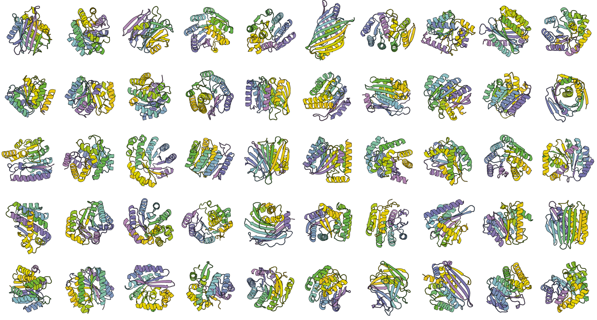

# Protpardelle-1c

<a href="https://colab.research.google.com/github/ProteinDesignLab/protpardelle-1c/blob/main/Protpardelle_1c.ipynb">
  
</a>

The original Protpardelle is detailed in our paper [An all-atom protein generative model](https://www.pnas.org/doi/10.1073/pnas.2311500121). Protpardelle-1c provides new models which achieve more robust motif scaffolding results benchmarked with [MotifBench](https://github.com/blt2114/MotifBench) and [La-Proteina](https://research.nvidia.com/labs/genair/la-proteina/). The code includes examples of unconditional sampling, partial diffusion, motif scaffolding, binder generation, and model training. For more details on the benchmarking results, new multichain support, architectural and dataset changes, please see our [preprint](https://www.biorxiv.org/content/10.1101/2025.08.18.670959v2). If you use Propardelle-1c, please cite [Chu _et al._, PNAS](https://www.pnas.org/doi/10.1073/pnas.2311500121) and [Lu & Shuai _et al._, BioRxiv](https://www.biorxiv.org/content/10.1101/2025.08.18.670959v2) ([see Citation below](#citation)).

<p align="center">
  
</p>

# Table of Contents

- [Protpardelle-1c](#protpardelle-1c)
- [Table of Contents](#table-of-contents)
- [Installation](#installation)
  - [Prerequisites](#prerequisites)
  - [Install dependencies](#install-dependencies)
  - [Download model weights and configs](#download-model-weights-and-configs)
  - [Set environment variables](#set-environment-variables)
  - [Available Models](#available-models)
- [Sampling](#sampling)
  - [Sampling Examples](#sampling-examples)
  - [Sampling Configs](#sampling-configs)
    - [`search_space.models`](#search_spacemodels)
    - [`search_space.step_scales`](#search_spacestep_scales)
    - [`search_space.schurns`](#search_spaceschurns)
    - [`search_space.crop_cond_starts`](#search_spacecrop_cond_starts)
    - [`search_space.translations`](#search_spacetranslations)
    - [`motifs`](#motifs)
    - [`motif_contigs`](#motif_contigs)
      - [Example contigs](#example-contigs)
    - [`total_lengths`](#total_lengths)
    - [`hotspots`](#hotspots)
    - [`ssadj`](#ssadj)
  - [Output](#output)
- [Training](#training)
  - [Datasets](#datasets)
- [Likelihood](#likelihood)
- [Citation](#citation)

# Installation

## Prerequisites

To run the scripts in this repository, we recommend using `conda` for environment management and `uv` for python dependency management. If you don't have `conda` installed yet, you can follow the instructions [here](https://www.anaconda.com/docs/getting-started/miniconda/install); `uv` installation will be automatically handled within `setup.sh`. If you are working on a cluster with limited home storage, set `CONDA_PKGS_DIRS` and `UV_CACHE_DIR` to a directory with higher storage quotas.

This repository was tested on Linux with `gcc>=12.4` and `cuda>=12.4`.

## Install dependencies

Next, you can clone the repository and install its dependencies by running:

```bash
# Clone the repository
git clone https://github.com/ProteinDesignLab/protpardelle-1c.git
cd protpardelle-1c

# Create and activate a conda environment
conda create -n protpardelle python=3.12 --yes
conda activate protpardelle

# Install dependencies using `setup.sh`
bash setup.sh
```

The `uv.lock` and `uv_indexes.txt` files are examples with exact versions of all installed packages. If you prefer a fixed environment, the dependencies can be installed by running:

```bash
git clone https://github.com/ProteinDesignLab/protpardelle-1c.git
cd protpardelle-1c

ENV_DIR=envs  # or any other directory of your choice
mkdir -p $ENV_DIR
uv venv $ENV_DIR/protpardelle -p python3.10
source $ENV_DIR/protpardelle/bin/activate

uv pip sync uv_indexes.txt uv.lock  --index-strategy=unsafe-best-match
uv pip install -e . --no-deps
```

## Download model weights and configs

Download the pre-trained model weights and corresponding configs from [Zenodo](https://zenodo.org/records/16817230). To run sampling with an all-atom model, download the original [ProteinMPNN weights](https://github.com/dauparas/ProteinMPNN/tree/main/vanilla_model_weights). To run evaluation, download the [ESMFold weights](https://huggingface.co/facebook/esmfold_v1) from Hugging Face.

We use [`aria2`](https://github.com/aria2/aria2) and [`huggingface-hub[cli]`](https://pypi.org/project/huggingface-hub/) in our download script. All downloads are automatically handled by running:

```bash
bash download_model_params.sh
```

It takes some time to download all the files; you should see the following directories created:

- `<project_root>/model_params/`
- `<project_root>/model_params/ESMFold/`
- `<project_root>/model_params/ProteinMPNN/vanilla_model_weights/`
- `<project_root>/model_params/configs/`
- `<project_root>/model_params/weights/`

Then install [Foldseek](https://github.com/steineggerlab/foldseek/tree/cfb431e98abcc5bcc49950285211d3723b47dc94) in your `PATH` following their instructions.

Outputs will be saved in `<project_root>/results/` by default.

## Set environment variables

> If you keep the default layout above, you can skip this section.

If the `foldseek` binary is already on your `PATH`, you do not need to set `FOLDSEEK_BIN`; otherwise set it explicitly (see below). To override file locations, set the following variables to absolute paths:

```bash
# (Optional) only if auto-detection of project root fails:
export PROJECT_ROOT_DIR=/abs/path/to/your/protpardelle-repo

# Model weights & configs (directory)
export PROTPARDELLE_MODEL_PARAMS=/abs/path/to/model_params

# ESMFold weights (directory)
export ESMFOLD_PATH=/abs/path/to/ESMFold

# ProteinMPNN weights (directory)
export PROTEINMPNN_WEIGHTS=/abs/path/to/ProteinMPNN/vanilla_model_weights

# Default output directory (optional; defaults to <project_root>/results)
export PROTPARDELLE_OUTPUT_DIR=/abs/path/to/output_dir

# Foldseek binary path (set this if foldseek is not already on PATH)
export FOLDSEEK_BIN=/abs/path/to/foldseek/bin
```

## Available Models

| Name | Monomers | Multichain | Model Type | Positional Encoding | Notes |
|------|----------|------------|------------|-------------------|-------|
| **bb81_epoch450** | 1 | 0 | Backbone | Rotary | Unconditional model trained on AI-CATH |
| **bbmd_epoch500** | 1 | 0 | Backbone | Rotary | Unconditional model trained on MD-CATH |
| **cc58_epoch416** | 1 | 0 | Backbone | Rotary | MotifBench benchmark model |
| **cc58_epochX** | 1 | 0 | Backbone | Rotary | Additional checkpoints of cc58 |
| **cc58-minimpnn** | 1 | 0 | Sequence design | - | Trained on cc58_epoch595 1-step x0 predicted structures |
| **cc78_epoch1431** | 0 | 1 | Backbone | Relative + Relchain | Experimental: residue index are tied across chains, favors homodimers |
| **cc83_epoch2616** | 0.5 | 0.5 | Backbone | Relative | Bindcraft benchmark model |
| **cc89_epoch415** | 1 | 0 | Allatom Sequence Mask | Rotary | Sequence must be provided at all sampling steps |
| **cc91_epoch383** | 1 | 0 | Allatom No Mask | Relative | Allatom model trained on AI-CATH |
| **cc91_tip_epoch480** | 1 | 0 | Allatom No Mask | Relative | cc91 finetuned on sidechain tip atom conditioning task |
| **cc94_epoch3100** | 0.5 | 0.5 | Allatom No Mask | Relative | cc91 finetuned on multichain data but no hotspots |
| **cc95_epoch3490** | 0.5 | 0.5 | Backbone | Relative + Relchain | cc83 finetuned with heavier hotspot dropout |

# Sampling

We recommend reading and running the example sampling configs under `examples/sampling` that cover the intended use cases of Protpardelle-1c models. The commands to run each demo are provided below:

```bash
# Unconditional sampling
python -m protpardelle.sample examples/sampling/00_unconditional.yaml --num-samples 8 --num-mpnn-seqs 0

# Partial diffusion
python -m protpardelle.sample examples/sampling/01_partial_diffusion.yaml --motif-pdb examples/motifs/nanobody/7eow_B_atom.pdb --num-samples 8 --num-mpnn-seqs 0

# Motif scaffolding
python -m protpardelle.sample examples/sampling/02_motif_scaffolding.yaml --motif-dir examples/motifs/nanobody --num-samples 8 --num-mpnn-seqs 0

# MotifBench benchmark
python -m protpardelle.sample examples/sampling/03_motifbench.yaml --motif-dir examples/motifs/motif_bench --num-samples 100 --num-mpnn-seqs 8 --use-wandb

# BindCraft benchmark
python -m protpardelle.sample examples/sampling/04_bindcraft.yaml --motif-dir examples/motifs/bindcraft/ --num-samples 100 --num-mpnn-seqs 2 --use-wandb

# Multichain
python -m protpardelle.sample examples/sampling/05_multichain.yaml --motif-dir examples/motifs/nanobody/ --num-samples 8 --num-mpnn-seqs 0

# Thread in a new sequence given a backbone: experimental feature
python -m protpardelle.sample examples/sampling/06_fastrelax.yaml --motif-dir examples/motifs/nanobody/ --num-samples 8 --num-mpnn-seqs 0

# Backbone-only La-Proteina / RFdiffusion benchmark
python -m protpardelle.sample examples/sampling/07_rfdiffusion.yaml --motif-dir examples/motifs/rfdiffusion/ --num-samples 200 --num-mpnn-seqs 1 --use-wandb

# All-atom La-Proteina / RFdiffusion benchmark
python -m protpardelle.sample examples/sampling/08_rfdiffusion_allatom.yaml --motif-dir examples/motifs/rfdiffusion/ --num-samples 200 --num-mpnn-seqs 1 --use-wandb

# Generate structure conditioned on sequence: experimental feature, useful as a decoy generator
python -m protpardelle.sample examples/sampling/09_structure_prediction.yaml --motif-dir examples/motifs/nanobody/ --num-samples 8 --num-mpnn-seqs 0

# Partial diffusion with residue level constraints: e.g. fixed motif partial diffusion
python -m protpardelle.sample examples/sampling/10-crop_cond_partial_diffusion.yaml --motif-dir examples/motifs/nanobody/ --num-samples 8 --num-mpnn-seqs 0

# Latent interpolation. See the Likelihood section for details.
python3 -m protpardelle.sample ./examples/sampling/11_latent_interp.yaml --motif-pdb /path/to/state0_or_1/file.pdb --num-samples 64 --num-mpnn-seqs 0
```

## Sampling Examples

- MotifBench samples and results are at [Zenodo](https://zenodo.org/records/16651614). These were produced with the `03_motifbench` config.
- RFdiffusion/La-Proteina motif scaffolding samples and results are at [Zenodo](https://zenodo.org/records/16887802). These were produced with the `07_rfdiffusion` and `08_rfdiffusion_allatom` configs.

## Sampling Configs

Multiple entries can be specified per setting in `search_space` and are combined with `itertools.product()`. The entries `motifs`, `motif_contigs`, `total_lengths`, `hotspots`, and `ssadj`, must be equal in number, i.e. two entries under `motifs` must be matched with two `motif_contigs`, etc.

### `search_space.models`

Model weights to use for sampling formatted as `[model_name, epoch, sampling_config]`. The recommended model is `cc58` for backbone-only single-chain conditional generation, `cc83` for backbone-only multi-chain conditional generation, `cc89` for all-atom single-chain structure refinement, and `cc91` for all-atom single-chain conditional generation.

### `search_space.step_scales`

List of floats where the model's score is scaled by this amount, where higher step scales correspond to lower temperature sampling and lower step scales correspond to higher temperature sampling. Higher step scales will likely reduce sample diversity. Recommended range for sweeps is `[0.8, 1.6]` with `1.2` being a good default in most use cases.

### `search_space.schurns`

List of floats where higher magnitudes inject more stochasticity during denoising and `0` is noise-free. The combination of step scale `1.0` and schurn `0` corresponds to ODE sampling. When evaluating a new model, we recommend to start with ODE sampling as this is exactly the denoising path the model has learned, without any _post hoc_ corrections. The same `schurn` may not generalize across different models; we have observed poor sample quality with `schurn=200` for the multi-chain all-atom models while `schurn=200` is okay for single-chain models. Note that the provided `schurn` parameter is divided by the total number of denoising steps to obtain the `gamma` parameter which controls how much additional Gaussian noise to add. Note also there are two parameters `s_t_min` and `s_t_max` which are not exposed to the sampling configs but accessible through the `sample()` function. They control the specific range in which stochastic sampling is applied.

### `search_space.crop_cond_starts`

List of floats in `[0.0, 1.0]` indicating the fraction of total denoising steps to start applying crop-conditional guidance.

### `search_space.translations`

Translate the input motif by `[x, y, z]` Ångstroms.

### `motifs`

Stem of the `.pdb` file containing the motif to scaffold. For convenience, the `.pdb` can contain extra residues, for example a native scaffold from the PDB. The `motif_contigs` will select the motif residues from the larger structure. The file should be located under the directory passed to `--motif-dir`. Set as `null` for unconditional sampling and set to the stem of the full structure for partial diffusion.

### `motif_contigs`

For partial diffusion, write `partial_diffusion`. For motif scaffolding, the contig follows similar syntax as RFdiffusion but we use `;/;` to denote a chain break. Note that the motif segments can be shuffled in arbitrary order, e.g. last example.

#### Example contigs

- `0-100;A1-21;0-100`: sample 0 to 100 scaffold residues, followed by motif PDB's chain A residues 1 to 21, followed by 0 to 100 scaffold residues.
- `A1-128;/;120-120`: condition on chain A residues 1 to 128, generate another chain with exactly 120 residues.
- `A1-79;/;B1-141;/;C1-33;/;70-150`: condition on chains A, B, and C, generate another chain with 70 to 150 residues.
- `F1-18;/;H1-92;/;20-40;D6-82;10-30;D101-125;20-40;A1-12;10-20`: condition on chains F and H, generate another chain containing residues D101-125 and A1-12 from the same input motif file with the specified flanking scaffold length ranges.

### `total_lengths`

List of list of integers indicating the number of residues per chain, where each sublist is the length range for each chain, so e.g. three chains require three sublists. For binder generation, the total lengths for the target chain(s) should match their number of residues.

### `hotspots`

For binder generation. A comma-delimited string with format `{chain_id}{residue_index}`.

### `ssadj`

For fold-conditioning, the stems of the output files from running the `make_secstruc_adj.py`, script from RFdiffusion, e.g. `["1pdb_ss", "1pdb_adj"]`. Per-residue secondary structure labels and per residue-pair block adjacency contact info are encoded as conditioning inputs. Fold-conditional model weights will be released at a later date.

## Output

The sampling outputs are saved in a nested folder structure where the levels are organized as such:

```text
PROTPARDELLE_OUTPUT_DIR
└── sampling-experiment-name
    └── model-epoch-sampling_config-stepscale-schurn-ccstart-dx-dy-dz-rewind
        └── motif-pdb-stem
```

For example, the demo `02_motif_scaffolding` with default sampling settings will generate the following folder structure under `PROTPARDELLE_OUTPUT_DIR`:

```text
02_motif_scaffolding
└── cc58-epoch416-sampling_sidechain_conditional-ss1.2-schurn200-ccstart0.0-dx0.0-dy0.0-dz0.0-rewindNone
    └── 7eow_CDR3_atom_rot_128
        └── scaffold_info.csv
            7eow_CDR3_atom_rot_128_0.pdb
            ...
└── cc95-epoch3490-sampling_sidechain_conditional-ss1.2-schurn200-ccstart0.0-dx0.0-dy0.0-dz0.0-rewindNone
    └── 7eow_CDR3_atom_rot_128
        └── scaffold_info.csv
            7eow_CDR3_atom_rot_128_0.pdb
            ...
└── cc94-epoch3100-sampling_sidechain_conditional_allatom-ss1.2-schurn200-ccstart0.0-dx0.0-dy0.0-dz0.0-rewindNone
    └── 7eow_CDR3_atom_rot_128
        └── scaffold_info.csv
            7eow_CDR3_atom_rot_128_0.pdb
            ...
```

This folder organization, in particular `scaffold_info.csv`, follows MotifBench input specifications.

# Training

First, modify `scripts/train.sbatch` to suit your environment. You will likely need to change the SLURM partition name and your wandb user/entity ID:

```bash
# In scripts/train.sbatch
#SBATCH --partition=your-partition-name
# ...
wandb_id="your-wandb-id"
```

The training script can then be launched via `sbatch`. It takes the following arguments:

1. `model_name`: The name of the model config in `examples/training/` (e.g., `cc58`).
2. `output_dir`: The directory where experiment results will be saved.
3. `--debug` (optional): A flag to run in debug mode.

For example, to run a training job for the `cc58` model and save outputs to `/path/to/experiments`:

```bash
# Submit a training job
sbatch scripts/train.sbatch cc58 /path/to/experiments

# Run in debug mode (run on an interactive node without submitting a job)
source scripts/train.sbatch cc58 /path/to/experiments --debug
```

A copy of the training config and model checkpoints will be saved under the specified output directory. You can also set the `WANDB_CACHE_DIR` environment variable to control where wandb stores its cache.

## Datasets

- [AI-CATH](https://zenodo.org/records/15881564): The CATH dataset described in the original Protpardelle paper but augmented with 32 ProteinMPNN sequences per structure. Structures are predicted by ESMFold. Models are trained on only the designable subset (337,936 / 704,448).
- [Boltz Interfaces](https://zenodo.org/records/16002744): PDB chain pairs curated following [Boltz-1](https://www.biorxiv.org/content/10.1101/2024.11.19.624167v4). Due to size, we only release the interface info from which PDB chain pairs can be extracted.
- [Secondary Structure / Adjacency](https://zenodo.org/records/16988261): Pre-computed `ssadj` inputs using [RFdiffusion's helper script](https://github.com/RosettaCommons/RFdiffusion/blob/main/helper_scripts/make_secstruc_adj.py) for both AI-CATH and Boltz interfaces passing resolution and length cutoffs.

# Likelihood

We provide a script for computing likelihoods and latents as described in [Song _et al._, ICLR 2021](https://arxiv.org/abs/2011.13456)

```bash
python -m protpardelle.likelihood --model-name cc58 --epoch 416 --pdb-path examples/motifs/nanobody
python -m protpardelle.likelihood --model-name cc89 --epoch 415 --pdb-path examples/motifs/nanobody
python -m protpardelle.likelihood --model-name cc91 --epoch 383 --pdb-path examples/motifs/nanobody
```

## Latent Interpolation

The uniquely identifiable encodings (latents) can be used for latent interpolation (see Figure 10 B in [SLAE](https://www.biorxiv.org/content/10.1101/2025.10.03.680398v1)). First, obtain latents with the likelihood script above. Then see `examples/sampling/11_latent_interp.yaml` in which `latent_dir` should match the output directory of the latents and `latent_paths` point to the `.pt` latents for the start and end states. For latent interpolation with all-atom models, the ground truth sequence is used during denoising through parsing the `--motif-pdb` input. This should be either the start or end `.pdb` structure for the interpolation using which the latents were obtained.

```bash
python3 -m protpardelle.sample ./examples/sampling/11_latent_interp.yaml --motif-pdb ./examples/motifs/latent_input_pdbs/some_pdb_code.pdb --num-samples 64 --num-mpnn-seqs 0
```

Previously, all-atom model likelihoods were computed on backbone atoms only. Here we compute all-atom model likelihoods for the all-atom models and backbone-only model likelihoods for the backbone-only models.

# Citation

```bibtex
@article{doi:10.1073/pnas.2311500121,
author = {Alexander E. Chu  and Jinho Kim  and Lucy Cheng  and Gina El Nesr  and Minkai Xu  and Richard W. Shuai  and Po-Ssu Huang },
title = {An all-atom protein generative model},
journal = {Proceedings of the National Academy of Sciences},
volume = {121},
number = {27},
pages = {e2311500121},
year = {2024},
doi = {10.1073/pnas.2311500121},
URL = {https://www.pnas.org/doi/abs/10.1073/pnas.2311500121},
eprint = {https://www.pnas.org/doi/pdf/10.1073/pnas.2311500121},
abstract = {Proteins drive many biological processes; the ability to design and engineer their structure and function has potential for impact across science, medicine, and engineering. Generative modeling with deep neural networks has emerged as a powerful approach for modeling and controllably sampling from the distribution of protein structures. However, many methods ignore the sidechain atoms, which drive most of protein function, focusing only on the backbone conformation. We describe a structure and sequence codesign algorithm which can generate the full atomic structure of proteins across the diverse folds found in the PDB, offering a way to design proteins conditioned directly on functional elements of interest. Proteins mediate their functions through chemical interactions; modeling these interactions, which are typically through sidechains, is an important need in protein design. However, constructing an all-atom generative model requires an appropriate scheme for managing the jointly continuous and discrete nature of proteins encoded in the structure and sequence. We describe an all-atom diffusion model of protein structure, Protpardelle, which represents all sidechain states at once as a “superposition” state; superpositions defining a protein are collapsed into individual residue types and conformations during sample generation. When combined with sequence design methods, our model is able to codesign all-atom protein structure and sequence. Generated proteins are of good quality under the typical quality, diversity, and novelty metrics, and sidechains reproduce the chemical features and behavior of natural proteins. Finally, we explore the potential of our model to conduct all-atom protein design and scaffold functional motifs in a backbone- and rotamer-free way.}}

@article {Lu2025.08.18.670959,
 author = {Lu, Tianyu and Shuai, Richard and Kouba, Petr and Li, Zhaoyang and Chen, Yilin and Shirali, Akio and Kim, Jinho and Huang, Po-Ssu},
 title = {Conditional Protein Structure Generation with Protpardelle-1C},
 elocation-id = {2025.08.18.670959},
 year = {2025},
 doi = {10.1101/2025.08.18.670959},
 publisher = {Cold Spring Harbor Laboratory},
 abstract = {We present Protpardelle-1c, a collection of protein structure generative models with robust motif scaffolding and support for multi-chain complex generation under hotspot-conditioning. Enabling sidechain-conditioning to a backbone-only model increased Protpardelle-1c{\textquoteright}s MotifBench score from 4.97 to 28.16, outperforming RFdiffusion{\textquoteright}s 21.27. The crop-conditional all-atom model achieved 208 unique solutions on the La-Proteina all-atom motif scaffolding benchmark, on par with La-Proteina while having \~{}10 times fewer parameters. At 22M parameters, Protpardelle-1c enables rapid sampling, taking 40 minutes to sample all 3000 MotifBench backbones on an NVIDIA A100-80GB, compared to 31 hours for RFdiffusion.Competing Interest StatementThe authors have declared no competing interest.U.S. National Science Foundation, https://ror.org/021nxhr62, DGE-2146755NIH Common Fund, https://ror.org/001d55x84, R01GM147893Merck Research Laboratories, Scientific Engagement and Emerging Discovery Science (SEEDS) ProgramStanford University School of Medicine, https://ror.org/011pcwc98, CatalystEuropean projects CLARA, No. 101136607ERC project FRONTIER, No. 101097822COST Action, CA21162 COZYMEG-Research, Loschmidt Laboratories, Czech Technical University in Prague and Masaryk UniversityStanford University, https://ror.org/00f54p054, Graduate Fellowship},
 URL = {https://www.biorxiv.org/content/early/2025/08/19/2025.08.18.670959},
 eprint = {https://www.biorxiv.org/content/early/2025/08/19/2025.08.18.670959.full.pdf},
 journal = {bioRxiv}
}
```
